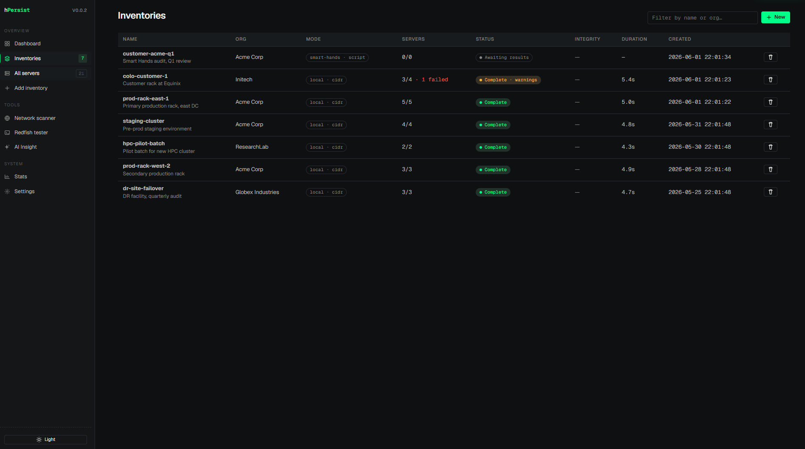
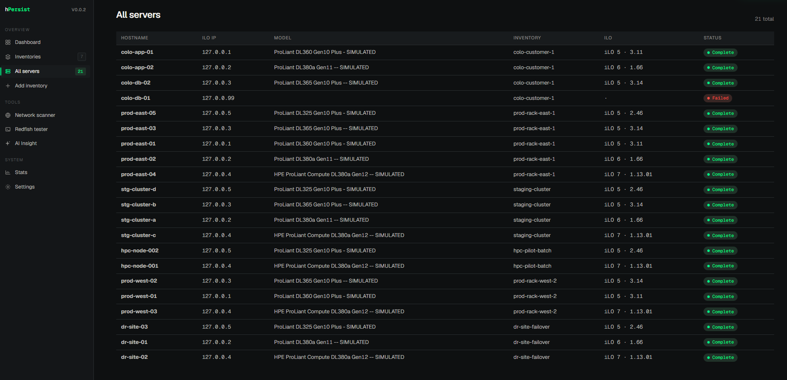
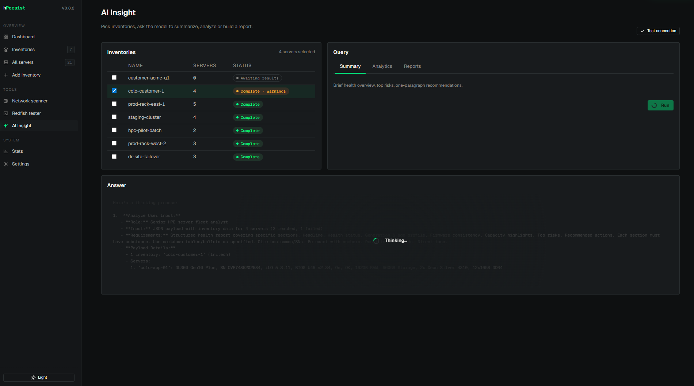
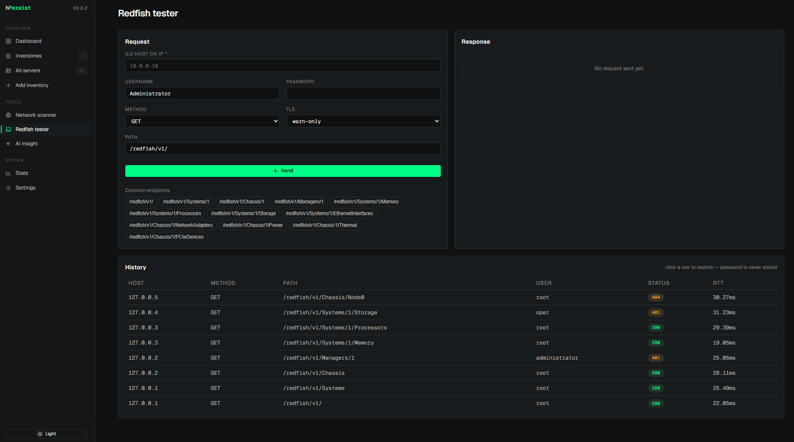

---
hide:
  - navigation
  - toc
---

<div class="hpersist-hero" markdown>

# hPersist

<p class="lead">HPE iLO/Redfish inventory collector — local sweep or Smart Hands hand-off.
Built for fleet engineers who want a fast, no-cloud, auditable snapshot of
what's actually in the rack.</p>

<div class="hpersist-badges">
  
  
  
  
</div>

<div class="hpersist-cta">
  <a class="md-button md-button--primary" href="https://github.com/ssealus/hPersist#quick-start">Quick start ↗</a>
  <a class="md-button" href="ARCHITECTURE/">Architecture</a>
  <a class="md-button" href="EXTENDING/">Extending</a>
  <a class="md-button" href="ROADMAP/">Roadmap</a>
</div>

</div>

## What it does

<div class="hpersist-features" markdown>

<div class="hpersist-feature" markdown>
### Walk a CIDR
Point it at a subnet, it discovers iLOs and pulls the full Redfish payload —
CPU, DIMM, drives, NICs, PSUs, firmware versions, health states.
</div>

<div class="hpersist-feature" markdown>
### Smart Hands hand-off
Generate a sealed `.tar.gz` collector that a remote engineer runs on-site;
ingest the signed result back. Hash chain proves the script wasn't tampered.
</div>

<div class="hpersist-feature" markdown>
### AI Insight
OpenAI-compatible LLM analysis of selected inventories — summary, free-form
Q&A, structured reports (procurement / firmware drift / EOL hardware). Opt-in
anonymizer strips SNs/hostnames before sending.
</div>

<div class="hpersist-feature" markdown>
### PartSurfer lookup
HPE Spare BOM lookup by SN / part / model with a 7-day cache. Deep-link from
any server-detail page jumps into a pre-filled search.
</div>

<div class="hpersist-feature" markdown>
### Redfish tester
Ad-hoc probe — pick a host, method, path, credentials; persistent history
so you can click-restore a previous request shape (no passwords stored).
</div>

<div class="hpersist-feature" markdown>
### Anonymized telemetry export
Counts, percentiles, distributions, fleet capacity. Zero SN/IP/hostname
exposure — safe to share with maintainers for benchmarking.
</div>

</div>

## Run it

=== "Docker"

    ```bash
    docker run --rm -p 8765:8765 -v hpersist-data:/data \
      ghcr.io/ssealus/hpersist:latest
    ```

    Open <http://127.0.0.1:8765>.

=== "venv"

    ```bash
    git clone https://github.com/ssealus/hPersist.git
    cd hPersist
    python -m venv venv && source venv/bin/activate     # or .\venv\Scripts\activate on Windows
    pip install -e .
    bash start.sh                                       # uvicorn on :8765
    ```

## Screenshots

<div class="hpersist-gallery" markdown>

<figure markdown>
  
  <figcaption>Fleet dashboard — recent runs, totals, model mix</figcaption>
</figure>

<figure markdown>
  
  <figcaption>Per-inventory overview — health, generation profile, iLO firmware drift</figcaption>
</figure>

<figure markdown>
  
  <figcaption>Server detail — components, firmware, raw Redfish payload</figcaption>
</figure>

<figure markdown>
  
  <figcaption>AI Insight — streaming LLM analysis with reasoning ghosted on the back</figcaption>
</figure>

<figure markdown>
  
  <figcaption>Redfish tester — ad-hoc probe with click-to-restore history</figcaption>
</figure>

</div>

## What's where

| | |
|---|---|
| [**Architecture**](ARCHITECTURE.md) | Layers, data flow, collector lifecycle |
| [**Extending**](EXTENDING.md) | Adding a new collector / locale / export / tool — single-file recipes |
| [**Roadmap**](ROADMAP.md) | Shipped vs deferred features, beyond-tools work |
| [GitHub repo ↗](https://github.com/ssealus/hPersist) | Source, releases, issues |
